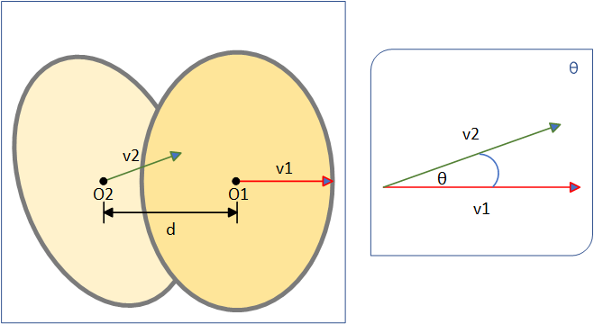
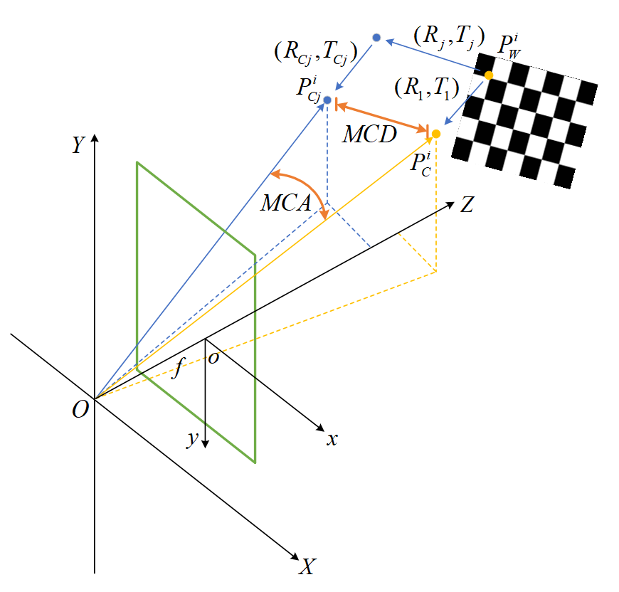
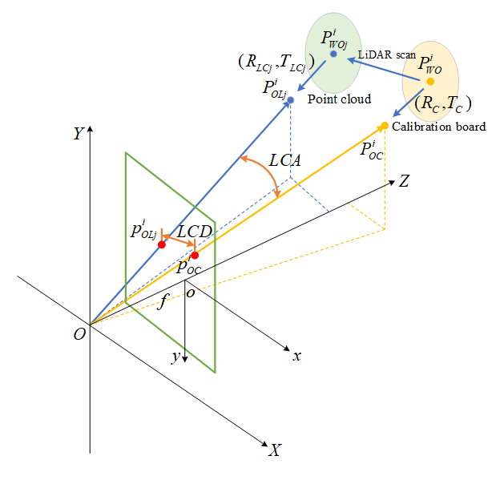
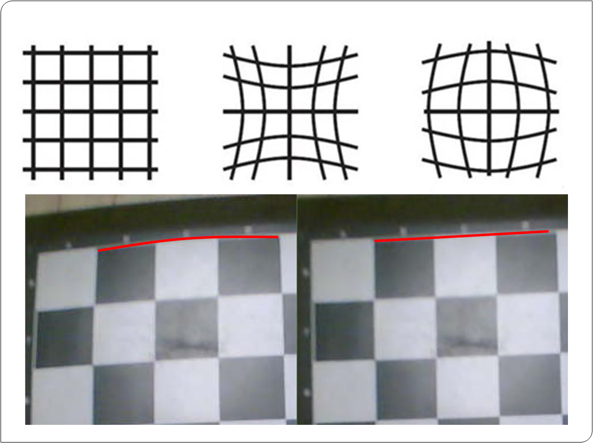

# Multi-Sensor_Calibration_Evaluation

#### Official code of the papar "Uniform Evaluation Metrics for Arbitrary Calibration of LiDARs and Cameras".

## Introduction
This project is an implementation of the evaluation methods proposed in our work, including lidar2lidar, lidar2camera, camera2camera, and distortion evaluation. We created a small dataset for joint radar and camera calibration. Baidu cloud disk link：https://pan.baidu.com/s/1yE1k58VjbPR30FnUPq18ig?pwd=xwug 

## Prerequisites

#### Python
- opencv-python

#### C++
- Cmake
- opencv 2.4
- eigen 3
- PCL 1.9
- Pangolin

## Lidar2Lidar Evaluate 
#### brief
#### Starting from the definition of point clouds and utilizing their characteristics, two evaluation methods are proposed, namely distance error and angle error.
 

## camera2camera Evaluate 
#### brief
#### After the joint calibration of the camera and the camera, the corner points corresponding to the timestamps of the two cameras are transformed into the camera coordinate system through external parameters. The Euclidean distance of the corresponding corner points is calculated as the distance error, and the angle between the corresponding corner points and the optical center is calculated as the angle error by forming a vector.
 

## Lidar2camera Evaluate 
#### brief
#### This evaluation method is similar to the camera and camera joint calibration evaluation method. It maps the corresponding point pairs of radar and camera data with the same timestamp to the camera coordinate system, calculates the two vectors formed by their connection with the optical center, and calculates their included angle as the angle error. Through actual experimental calculations, the angle error is affected by camera distortion, which is difficult to consider as a factor in data fusion. Moreover, due to scale factors, distance error cannot be used as an evaluation method. The final experimental result is that in terms of data fusion, re projection error is a good evaluation indicator.
 

## Distorion Evaluate 
#### brief
#### The project also calculated the size of the variance before and after image distortion removal, in order to further evaluate the degree of distortion. This evaluation is not yet fully completed, but data and line charts are provided, which can provide some inspiration.
 
