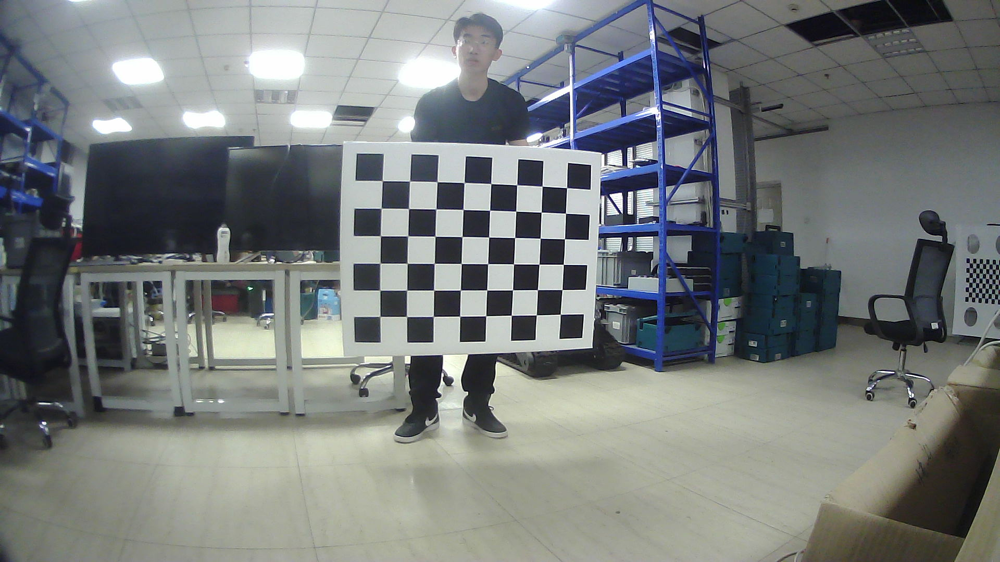
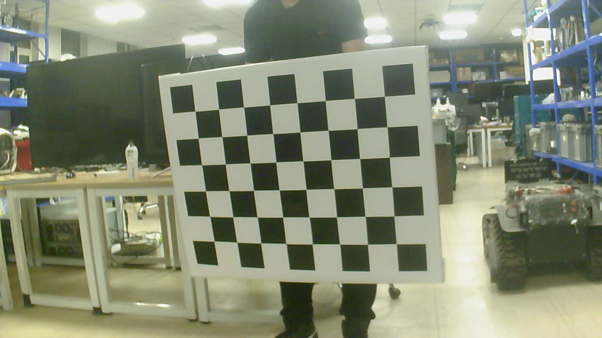
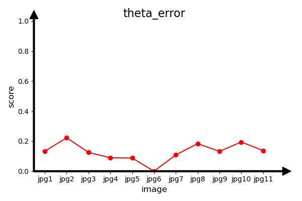

## Introduction
This project is an implementation of the camera2camera evaluation proposed in our work.

## Prerequisites

#### Python
- opencv-python
- matplotlib

## Quick Start

```shell
# Camera2Camera Calibrate
source calib.sh
# Visualization results
source Pic.sh
```


## Data

#### camera1 image
<br>

#### camera2 image
<br>

These photos of camera 1 and camera 2 with the same timestamp

#### Data placement requirements
Two cameras are placed in different positions, with fixed relative poses, and can collectively capture a checkerboard pattern.

## Results

#### Calibration results of two cameras

<br>

#### Distance error in camera coordinate system

<br>

#### Angle error in camera coordinate system
<br>

#### Average Reprojection Error in Pixel Coordinate System
<br>


