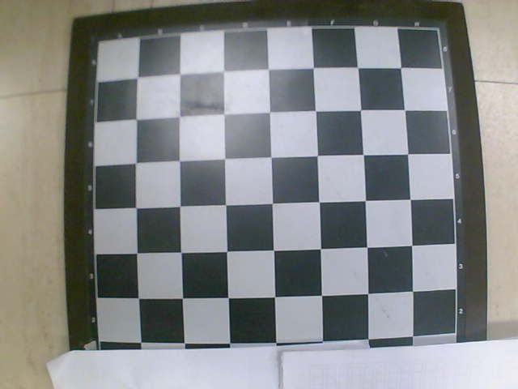
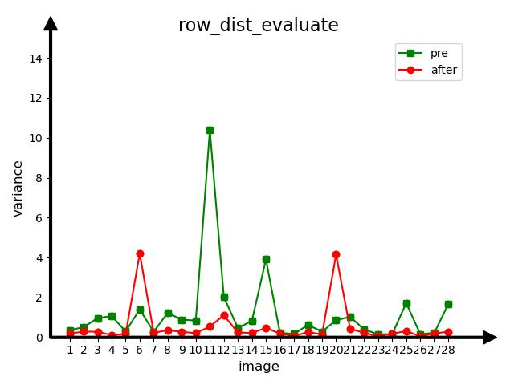
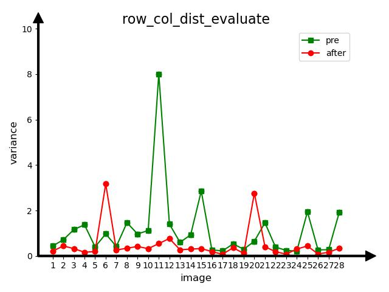

## Introduction
This project is an implementation of the distortion evaluation proposed in our work.

## Prerequisites

#### Python
- opencv-python
- matplotlib

## Quick Start

```shell
# Calculate the length of edge
source calculate.sh
# Visualization results
source evaluate_dist.sh
```


## Data
<br>

#### Data placement requirements
When aiming the camera at the calibration board to take photos, try to be perpendicular to the calibration board as much as possible, so that the calibration board is displayed symmetrically in the image.

<br>

## Results

#### Changes in row variance before and after orthodontic treatment

<br>

#### Changes in column variance before and after orthodontic treatment

<br>

#### Changes in the mean of row variance and column variance before and after orthodontic treatment
<br>


