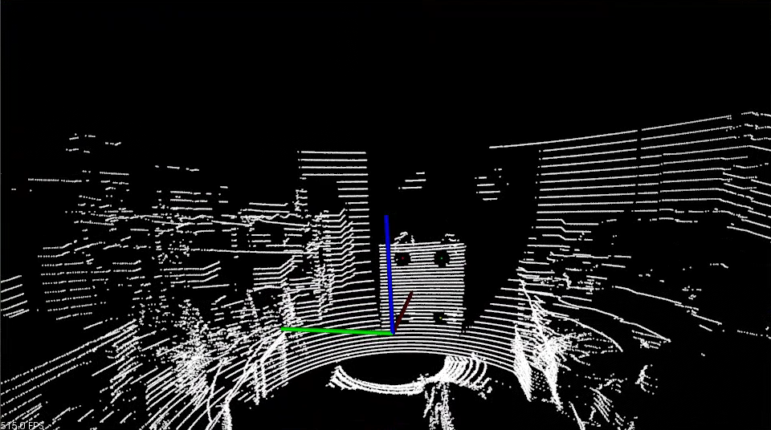
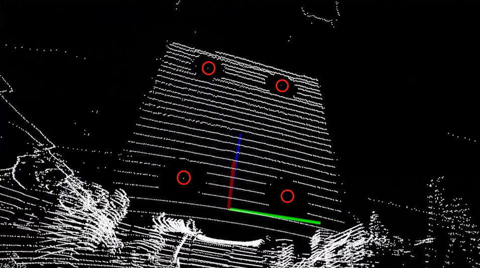
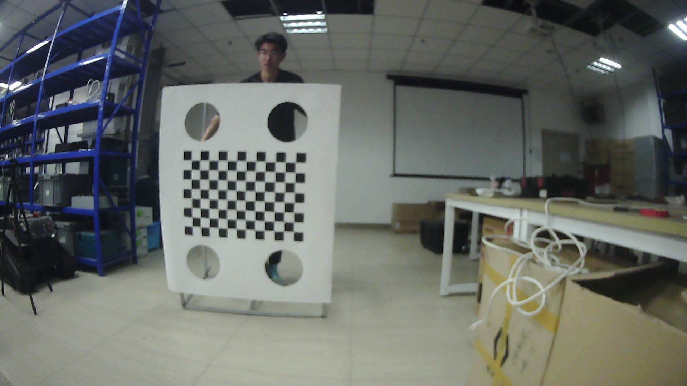
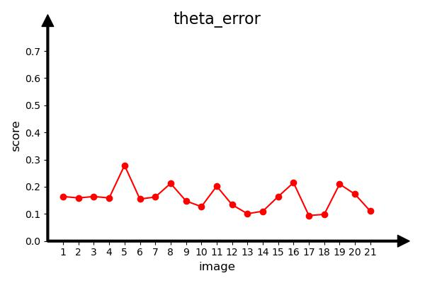
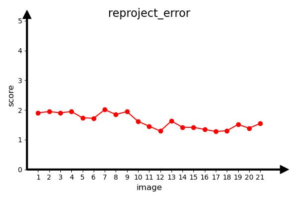
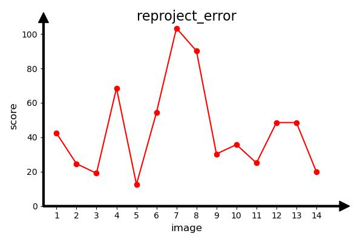

## Introduction
This project is an implementation of the lidar2camera evaluation proposed in our work.

## Prerequisites

#### Python
- matplotlib

#### C++
- Cmake
- opencv 2.4
- eigen 3
- PCL 1.9
- Pangolin

## Quick Start

#### Calculate the centers of four circles
```shell
# Frist, Save the PCD point cloud file in the PCD file
# Second, Select 16 points around the calibration board circle
# For example : cloud data of pcd named 10.pcd
# Change directory to Calculate_Points/View_Cloud/bin/
./run_cloud 10
# The 16 selected points will be saved in the points_ 10.txt
# Check for manual removal of duplicate or incorrectly selected points
# Change directory to Calculate_Points/
# calculate the center of the circle
python circle_center.py
# The four calculated centers are  saved in the Center_Points, named center_points_10.txt
# Change directory to Calculate_Points/show/build/
./singshow 10
```

#### Docker pull
```shell 
# Docker hub :scllovewkf/opencalib:v1
sudo ./run_docker.sh 
```

#### Joint calibration of lidar and camera
```shell
# 1:simulation data joint calibration
# Change directory to lidar2camera/
# Directory save camera images in intrinsic and lidar center points of circle in circle.csv
./bin/lidar2camera data/intrinsic_1/ data/circle_1.csv
# Change directory to my_lidar2camera/
# Directory save camera images in intrinsic and lidar center points of circle in circle.csv
# 2:collect data joint calibration
./bin/lidar2camera data/intrinsic_4/ data/circle_4.csv
# Visualization results
# Modify Pic.sh file parameters
source Pic.sh
```
Pic.sh parameters
```
Usage: python <file.py> <results_txt_path> <save_jpg_path>
```
+ **file.py:** Reprojection error or angle error drawing program
+ **results_txt_path:** Txt file of lidar2camera joint calibration error results
+ **save_jpg_path:** Jpg image save path


## Data

#### lidar cloud
<br>

#### lidar 4 center points
<br>

#### camera image
<br>

These clouds of lidar and jpgs of camera 2 with the same timestamp

#### Data placement requirements
Two cameras are placed in different positions, with fixed relative poses, and can collectively capture a checkerboard pattern.

## Results
### simulation data
#### Theta error in lidar2camera joint calibration

<br>

#### reproject error in lidar2camera joint calibration

<br>

### collected data
#### Theta error in lidar2camera joint calibration
<br>

#### Distance error in lidar2camera joint calibration
<br>


