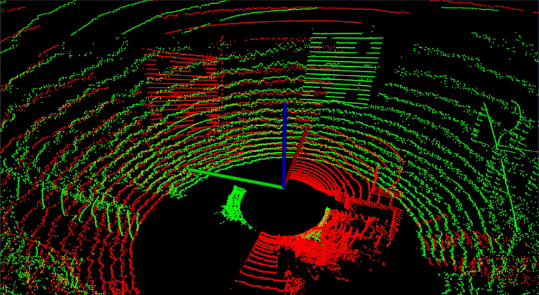
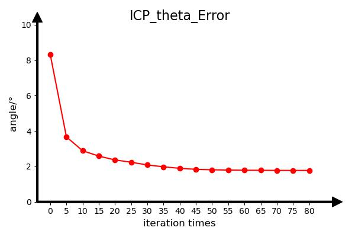
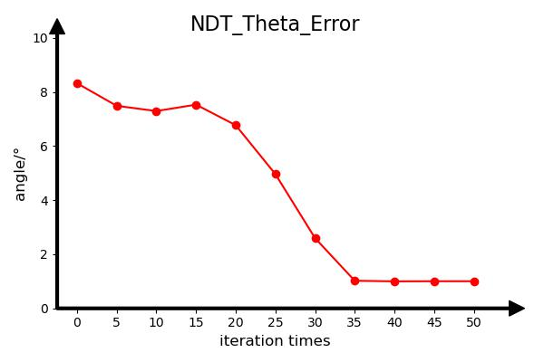

## Introduction
This project is an implementation of the lidar2lidar evaluation methods proposed in our work,.

## Prerequisites

#### Python
- matplotlib

#### C++
- Cmake
- opencv 2.4
- eigen 3
- PCL 1.9
- Pangolin

## Quick Start

    ICP Method

```shell
# ICP Algorithm Point Cloud Registration
# Input "Space" of keyboard  Control the number of iterations
# Input "s" of keyboard Save the current source point cloud
source ICP_Start.sh
# Hold down shift+left mouse button to select points in the point cloud
# Mouse control zoom and adjust position, select four points around the calibration board circle, a total of two point clouds, first select the target point cloud, and then select the source point cloud, When selecting four points from two point clouds, follow the same order. The selected points from the two needle point cloud are saved in target_points.txt and input_points.txt
source ICP_Move_Data.sh
# First, remove the points with incorrect selection in target_points.txt and input_points.txt, then use "source Evaluate.sh". Using the selected points from two point clouds, calculate the center of the circle and the normal vector, and calculate the angle error and distance error
source Evaluate.sh
# Visualization results
source ICP_Pic.sh
```
    NDT Method

```shell
NDT Method
# NDT Algorithm Point Cloud Registration
# Input "Space" of keyboard  Control the number of iterations
# Input "s" of keyboard Save the current source point cloud
source NDT_Start.sh
# Hold down shift+left mouse button to select points in the point cloud
# Mouse control zoom and adjust position, select four points around the calibration board circle, a total of two point clouds, first select the target point cloud, and then select the source point cloud, When selecting four points from two point clouds, follow the same order. The selected points from the two needle point cloud are saved in target_points.txt and input_points.txt
source NDT_Move_Data.sh
# First, remove the points with incorrect selection in target_points.txt and input_points.txt, then use "source Evaluate.sh". Using the selected points from two point clouds, calculate the center of the circle and the normal vector, and calculate the angle error and distance error
source Evaluate.sh
# Visualization results
source NDT_Pic.sh
```

## Data
<br>

#### Data placement requirements
Select two point clouds to be registered

## Results

#### Point cloud process during ICP algorithm registration

<br>

#### Changes in angle error during ICP algorithm registration process
<br>

#### Changes in distance error during ICP algorithm registration process
<br>

#### Point cloud process during NDT algorithm registration

<br>

#### Changes in angle error during NDT algorithm registration process
<br>

#### Changes in distance error during NDT algorithm registration process
<br>
